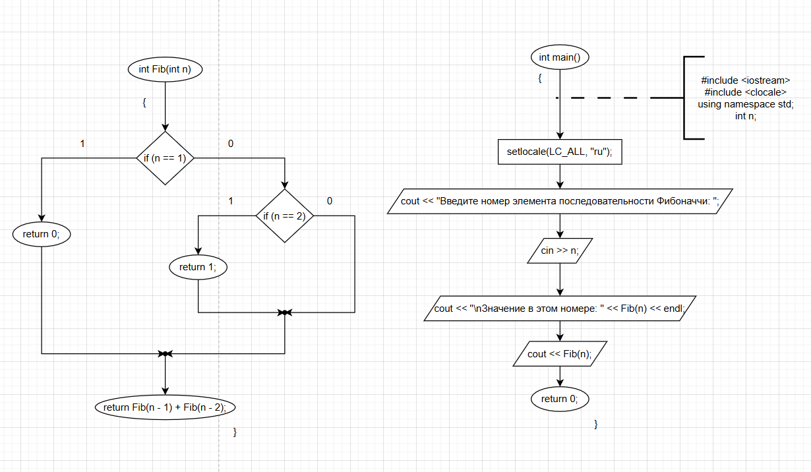

 
**Статус:** ✅ Сдано

  

## Блок-схема:




  

---

  

## Исходный код:

  

```cpp
#include <iostream>
#include <clocale>
using namespace std;

int Fib(int n)
{
	if (n == 1)
	{
		return 0;
	}
	if (n == 2)
	{
		return 1;
	}
	else
	{
		return Fib(n - 1) + Fib(n - 2);
	}
}
int main()
{
	setlocale(LC_ALL, "ru");
	int n;
	cout << "Введите номер элемента последовательности Фибоначчи: ";
	cin >> n;
	cout << Fib(n);
	return 0;
}

```
---
## Пример работы:

**Ввод:**

```
Введите номер элемента последовательности Фибоначчи: 6
```

Вывод:

```
Значение в этом номере: 5
```


[Скриншот работы программы](screenshots/Fibonacci_run.png)